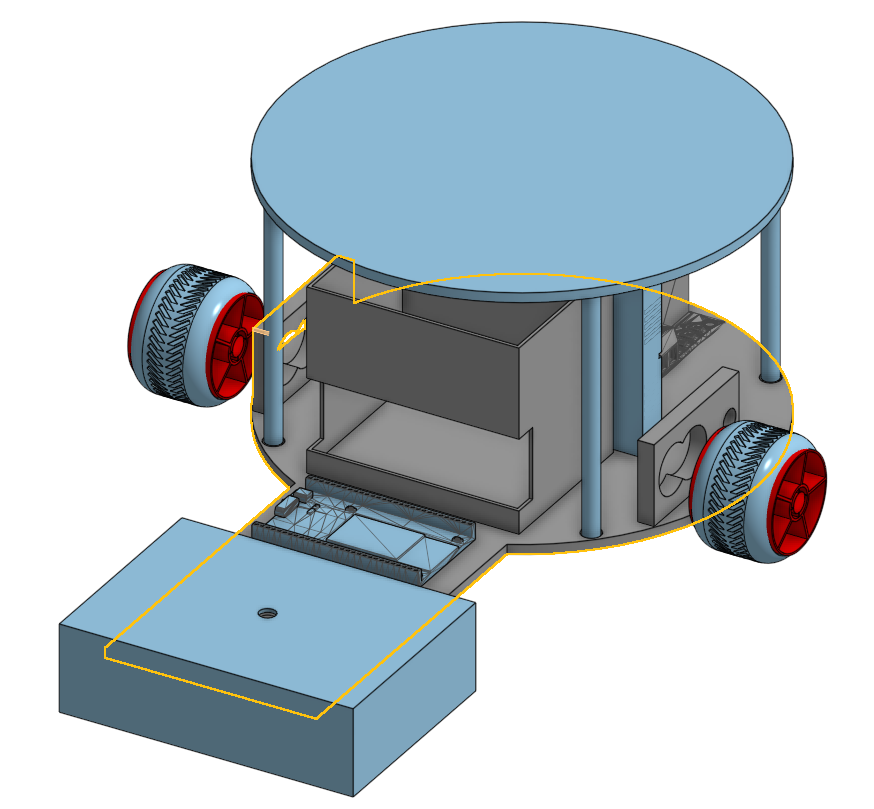

## Project Advice
---

### Prototyping & Testing 

**The Creation Process: TurtleBot**
Our TurtleBot was created from the results of many design, and previous prototypes. The initial design was inspired from an existing robot but it had to be modified to fullfill the constraints of ECE 5's final project. Which meant making the design work with only the supplies provided.

**Iterations:**
With exploration iterations await, failed designs that had fatal flaws had became steps towards our final design.In the end the problems we faced furthered our understanding of fabrication and design.

*Some of the problems faced that we overcame with our itertains*
1. Un-even mass distribution. Our center of mass was in an un-desired position causing the robot to follow a circular trajectory instead of a linear one. 
2. Motor placements: The location of the motors is crucial for ensuring that the weight is distributed evenly, preventing the robot from overworking the motors. 
3. 3D Printing: One of the issues faced during the creation of the project was wait time, having to wait until a 3D printer was free from use. An additional problem faced was failed prints, not using supports when overhangs are present. Certain printers have time printing upright which caused a problem when printing our TurtleBot's pillars.

---

## 3D Modeling Iterations 

**3D Model Iterations:**

## Final Model 

---

## Robot Iterations 

## Final Robot 

**Learning Lesson:**
    Failure in nature is an opportunity to grow a deeper understanding of a problem.

