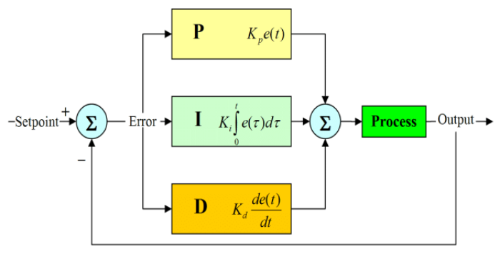

## Controlling a TurtleBot
---

### PID Controllers & TurtleBot Kinematics 

**Background on Control Theory**

PID controllers, otherwise known as Proportional–Integral–Derivative controllers, are tools used to regulate the behavior of a system. They originate from a field called control theory, which focuses on creating mathematical models of systems. By developing a mathematical model, engineers can design control functions that produce desired outcomes and ensure the system behaves in a stable and predictable way.

---
## Differential Drive Model:

Our TurtleBot is an example of a control system. The kinematics of the TurtleBot can be described by the differential drive model. Unlike a car, which uses a steering joint to turn its front wheels, our TurtleBot turns by varying the speeds of its two wheels. By increasing the speed of one wheel and decreasing the speed of the other, the robot can rotate left or right.

---

## Proportional Intergral Derivitave Controller:

---

**Explaining each term of the controller:**

**P:** 
    Proprotional term of the controller measures the current error of the system. 

The proprotional term of the controller calculates how off the robot is from the black line. That error is then mutliplied by a gain which is used to steer the robot  back onto the black line. 

**I:** 
    Integral term of the controller occumulates past-errors over time. 

The Integral portion of the controller is useful in reducing steady state error. It allows the robot to stay some threshold within the objective. By measuing that the accumulation of previous errors is decreaing it allows the robot to stay within proximity of the line even if it's not exactly spot on.

**D:** 
    Derivitave term of the controller measures the rate of change of the system. 

The Derivitave portion of the controller is useful in reducing oscilations. By measuring the rate at which the error is changing the derivitave portion of the controller reduces how much the robot overshoots the line.

**K Terms:**
    All of the K terms are constant-terms decided by the user, they're not random, they're discoevered by trial and error in a process called tunning. The K terms decide how aggressively the PID components will contribute to the outcome.

---

## Competition PID Values: Theory In Action

*Track 1:*

Picture of track 1 

**P:** 

**I:** 

**D:** 

**K Terms:**

*Track 2:*
Pciture of track 2 

**P:** 

**I:** 

**D:** 

**K Terms:**

*Track 3:*
Picture of track 3 

**P:** 

**I:** 

**D:** 

**K Terms:**

