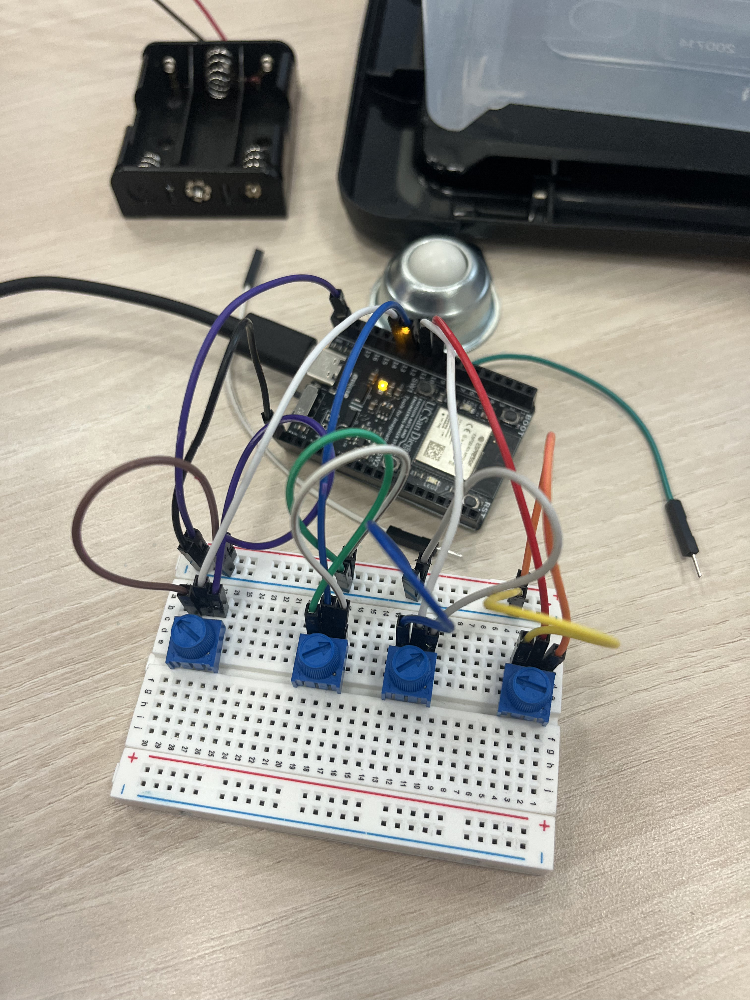

## ECE 5 Line Following TurtleBot
---

### Objective: Follow A Line Autonomously

How can we follow a line without having ambient light get in the way?

By utilizing the fact that darker colors absorb more light than lighter colors, we can use photoresistors to measure how much light is reflected off a line. When light bounces back from the surface, our photoresistors detect this reflected light and produce a voltage that can be read by our ESP32. Since our microcontroller cannot measure resistance directly, it's not a multimeter, we use voltage measurements instead to detect the line.

A major engineering problem when designing our robot that relies on light sensing is noise, particularly ambient light, which can interfere with the data the sensors collect.

To address this, we decided to create a TurtleBot with a small skirt around the sensors to block most ambient light. Additionally, to reduce the impact of random noise, we generate our own controlled light source rather than relying solely on the room’s variable lighting conditions.

Another important system component that ensures successful line following is a PID controller, which stabilizes the robot’s trajectory and allows it to respond smoothly to deviations from the line and potential disturbances.

## 3D Modeling

---

## Construction 
To complete our objective of following a line, we had to assemble the components that would allow our robot to move, detect a line, and allow for quick PID tuning. 

Hardware Powering the TurtleBot:

**Light Dependent Ressitors: Allows our robot to sense a line**

**DC Brushless Motors: Powered by an external power supply**

**Potentiometers: Allow Fast PID tunning**

---

## Final product 

